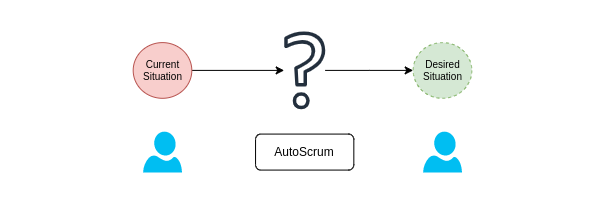
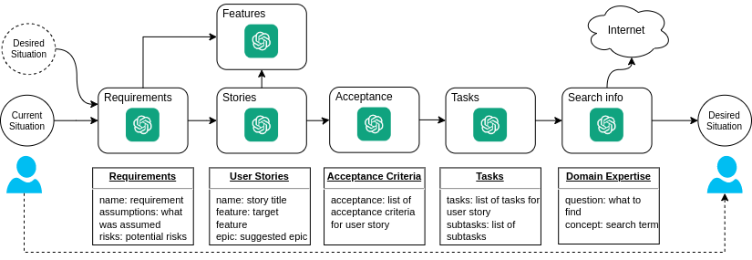
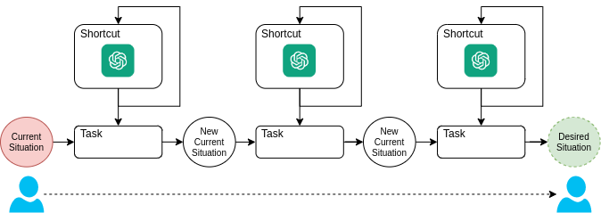

# AutoScrum

AutoScrum is a python script for automating the Scrum project planning process
using language models.

[Download Research Paper](https://github.com/autoscrum/autoscrum/raw/main/Martin-Schroder-AutoScrum-Paper.pdf)

You provide it with your product name, current customer situation and desired
customer situation and the script does the rest.



AutoScrum is designed to assist users with the automatic generation of detailed
scrum plans using language models.



AutoScrum also supports shortcut mode where a single language program is used to generate the next
most urgent task to bridge the gap between current and desired situation. The shortcut mode does not
create any user stories or features. Instead it simply iteratively creates a plan.



By using AutoScrum, you can generate stories, features, goals, requirements,
tasks, acceptance criteria, and clarifications for your scrum planning. 

## Installing

You can install dependencies using pip:

    pip3 install autoscrum

## How to Use

First create a json file that contains your initial parameters. See tests/test-run.json for an
example.

```json
{
    "product": "Your product name",
    "vision": "Your product vision",
    "niche": "Your target customer niche",
    "current_state": {
        "some_state": 10
        "some_other_state": 5
    },
    "desired_state": {
        "some_state": 20
        "some_other_state": 50
    },
    "plan": [
    ],
    "requirements": [
    ],
    "sprint_duration": "2 weeks",
    "features": [
    ],
    "stories": [
    ],
    "avoid": []
}
```

AutoScrum will fill this file with results.

To use the AutoScrum script, follow these steps:

1. Pass the JSON data file for your scrum plan as an argument using the `-f` or `--data-file` option when you run the script. 
   
    Example:

    ```sh
    autoscrum -f my_scrum_data.json <command> <params>
    ```

2. Select the command you want to execute. The available commands are: `stories`, `features`, `goals`, `clarify`, `acceptance`, `tasks`, `requirements`, `plan`.

    Example:

    ```sh
	autoscrum -f my_scrum_data.json stories
    ```

3. Use `-n` or `--count` option to define the number of items you want to generate for the selected command. The default count is 3 for most commands, and 1 for the `plan` command.

    Example:

    ```sh
    autoscrum -f my_scrum_data.json stories -n 5
    ```

## Commands

Here are the available commands:

- `stories`: Generate user stories.
- `features`: Generate features.
- `goals`: Generate sprint goals.
- `clarify`: Generate clarification questions for your stories.
- `acceptance`: Generate acceptance criteria for your stories.
- `tasks`: Generate tasks for your stories.
- `requirements`: Generate project requirements.
- `plan`: Generate a shortcut plan.

## Output

The script prints the existing items (if any) of the selected type (stories,
features, goals, etc.) before it generates and prints the new items. The new
items are automatically added to your JSON data file.

## Note

This script is meant to assist with scrum planning, but the generated content
should be reviewed and approved by your scrum team before use. Always consider
your specific project needs when planning a sprint.

